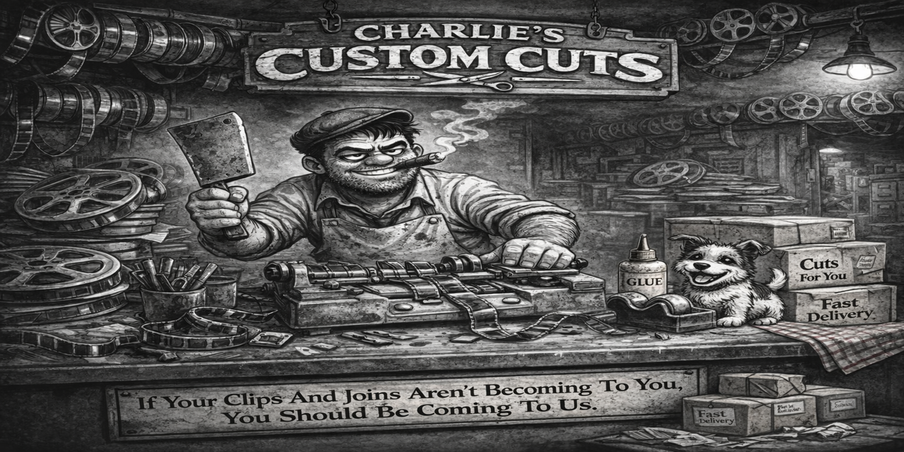

# CHARLIE'S CUSTOM CUTS

Charlie’s Custom Cuts is a standalone video tool for fast, accurate one-off clip work.

Charlie does two jobs:
- cut a segment out of a video
- join two clips together

He is not a full pipeline. He is the guy behind the counter who gets the job done right.

## What Charlie Does

### Custom Cut
Charlie performs frame-accurate clip extraction using re-encode trimming. This makes his cuts reliable even when the source file has poor keyframe spacing or awkward structure.

### Join Two Clips
Charlie can also join two clips together using a fast concat copy workflow when the sources are compatible. This keeps joins quick and efficient when conditions are good.

### Keyframe Cut-Friendliness Check
Charlie inspects source files before critical work. He checks keyframe spacing, measures average and maximum gaps, and warns when a file is likely to cause ugly joins or unreliable copy-based behavior.

## Work Ethic

Charlie works by a simple rule:

> If the work will not come out clean, you should know before it happens.

He does not silently push through bad source material and pretend everything is fine. He warns when files are risky, explains why, and lets the user decide whether to proceed.

## Design Philosophy

- Standalone and self-contained
- Fast when conditions allow
- Accurate when precision matters
- Honest about source limitations
- Built for direct work, not bloated workflows

## Direction

Charlie is evolving toward smarter source-aware behavior. The current keyframe probe is the first step. Future versions may offer optional cut-friendly working copies for difficult files, allowing cleaner joins on problem sources without changing Charlie’s basic identity.

## Summary

Charlie is built for quick results, clean cuts, and honest warnings.

No guesswork. No hidden behavior. Just solid work.
